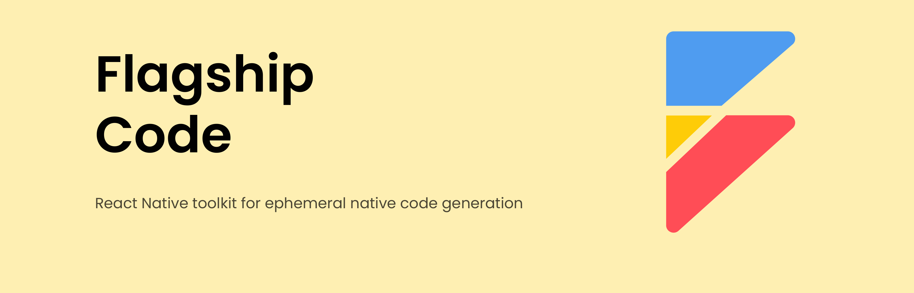

# Flagship Code

<picture>
  
</picture>

<h2 align="center">A React Native Configuration as Code Toolkit.</h2>

## Features

- **🏗 Code Generation**: Combination of parser and transformation modules to update and generate iOS and Android native code.
- **🛟 Type-safe Configurations**: Build and runtime type-safe configurations empowering configuration as code.
- **🔌 Plugin Ecosystem**: Out-of-the-box plugins to manipulate native code with the ability to plug-n-play custom transformations.
- **🛠 Development Toolkit**: Exposed modules and generators to help develop custom plugins for specific third-party requirements.
- **🪂 Vendor Freedom**: Don't enjoy the experience of Flagship Code? No problem, eject at any time with no left-over side-effects

## Getting Started

Go to the [Quick Start](https://brandingbrand.github.io/flagship/) to get started.

## Contribution

Please read the [contributing guide](./CONTRIBUTING.md) and let's build Flagship Code together.

If you have any questions, you can open an issue to communicate with us.

### Code of Conduct

Please check [Code of Conduct](./CODE_OF_CONDUCT.md) for more details.

### License

Rspress is licensed under the [MIT License](./LICENSE).
