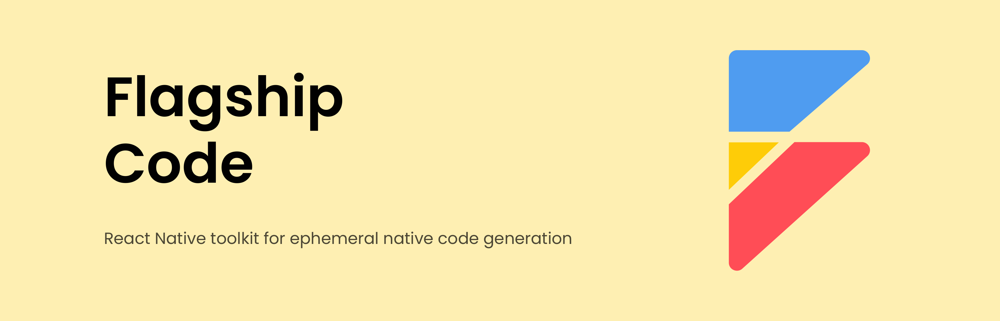

# Flagship Code

<picture>
  
</picture>

<h2 align="center">A React Native Configuration as Code Toolkit.</h2>

## Features

- **🏗 Code Generation**: Utilize a comprehensive suite of parser and transformation modules to efficiently update and generate iOS and Android native code.
- **🛟 Type-safe Configurations**: Implement type-safe configurations at both build and runtime, enhancing the robustness of configuration as code practices.
- **🔌 Plugin Ecosystem**: Benefit from a diverse range of out-of-the-box plugins designed to seamlessly manipulate native code. Easily integrate custom transformations with plug-and-play functionality.
- **🛠 Development Toolkit**: Access exposed modules and generators tailored to facilitate the creation of custom plugins, simplifying the integration process for third-party React Native libraries.
- **🪂 Vendor Freedom**: Experience the freedom to choose without constraints. Seamlessly transition away from Flagship Code at any time, ensuring a smooth transition with no residual side-effects.

## Getting Started

Go to the [Quick Start](https://brandingbrand.github.io/flagship/) to get started.

## Contribution

Please read the [contributing guide](./CONTRIBUTING.md) and let's build Flagship Code together.

If you have any questions, you can open an issue to communicate with us.

### Code of Conduct

Please check [Code of Conduct](./CODE_OF_CONDUCT.md) for more details.

### License

Rspress is licensed under the [MIT License](./LICENSE).
